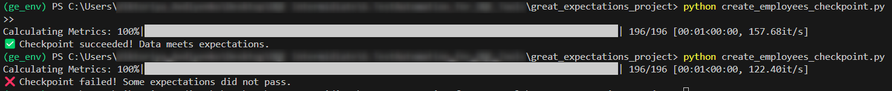
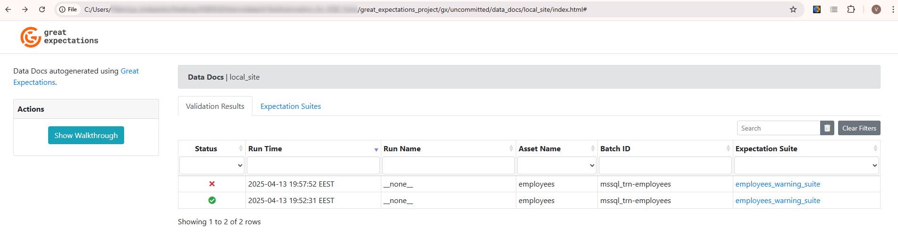

# 🧪 Great Expectations Project Setup

This project demonstrates how to set up a Great Expectations (GX) workflow using a virtual environment, connect to an MSSQL database, profile a dataset, create expectations, validate data through checkpoints, and explore Data Docs.

##  Prerequisites
 - Windows OS
 - Python 3.9+ installed
 - ODBC Driver 17 for SQL Server
 - Access to MS SQL Server (TRN database)

## Project Goals

This project demonstrates how to:
1. Set up a GE project connected to a Microsoft SQL Server database.
2. Automatically generate expectations using a **profiler**.
3. Explore **Data Docs** to review validation results.
4. Create and run a **checkpoint** to verify data quality.
5. Simulate a data quality failure and detect it with GE.

## 📦 Folder Structure

```bash
project-root/
│
├── ge_env/                               # Virtual environment (ignored in Git)
│
├── gx/                                   # GX core config folder
│   ├── great_expectations.yml            # GE configuration file
│   ├── expectations/                     # Expectation suites
│   ├── checkpoints/                      # Checkpoint definitions
│   ├── validation_definitions/           # (Optional) validation rules
│   ├── uncommitted/                      # Local runtime output 
│   │   ├── config_variables.yml          # Credentials or local settings
│   │   ├── validations/                  # Validation results
│   │   └── data_docs/                    # Rendered Data Docs
│   └── plugins/                          # Custom components (optional)
│
├── scripts/                              # Custom scripts to set up & run checks
│   ├── init_ge.py                        # Initialize GE context
│   ├── connect_mssql_trn.py              # Add MSSQL datasource
│   ├── register_mssql_datasource.py      # Register employees table
│   ├── test_db_connection.py             # Validate connection + sample query
│   ├── create_employees_warning_suite.py # manually created expectations for testing purpose
│   ├── profile_employees_suite.py        # Profile & generate expectations
│   ├── create_employees_checkpoint.py    # Run checkpoint to validate data
│
├── .gitignore
├── requirements.txt
└── README.md
```

## 🛠 Setup Instructions
### Step 1. Clone the Repository and Open in VS Code
```bash
git clone https://github.com/VikaAvd/great_expectations_project
cd great_expectations_project
```
### Step 2. Create and activate a virtual environment
```bash
python -m venv ge_env
./ge_env/Scripts/Activate    
```
### Step 3. Install dependencies
```bash
pip install -r requirements.txt
```
### Step 4. Initialize GE context
```bash
python scripts/init_ge.py
```
### Step 5. Connect to MSSQL TRN
```bash
python scripts/connect_mssql_trn.py
```
Note: use your values
### Step 6. Register the employees table as a Data Asset
```bash
python scripts/register_mssql_datasource.py
```
### Step 7. Test the DB Connection (Optional)
```bash
python scripts/test_db_connection.py
```
You should see a small preview of the employees table.


## 🔍 Profile the Table & Generate Expectations
### Profile the Table & Generate Expectations
```bash
python scripts/profile_employees_suite.py
```

### Run a Checkpoint and Validate Data
```bash
python scripts/create_employees_checkpoint.py
```
 - ***If everything is okay, you will see:***
```✅ Checkpoint succeeded! Data meets expectations.```
 - ***If data has quality issues:***
```❌ Checkpoint failed! Some expectations did not pass.```

💡 Tip: You can intentionally modify the employees table (e.g. add a row with salary = 1000) to simulate data quality issues and see expectations fail.

### Review Data Docs in the folder:
```gx/uncommitted/data_docs/local_site/index.html```



